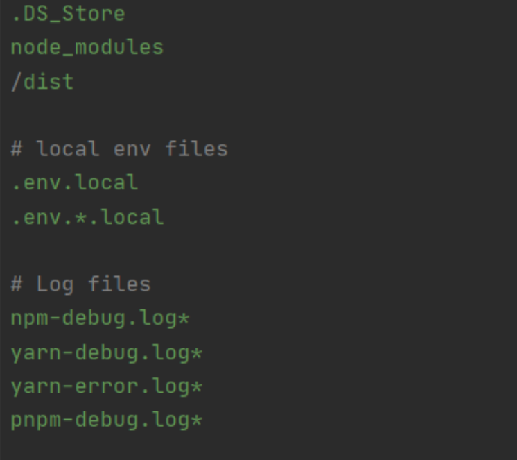

# Основные правила синтаксиса файла `.gitignore`:

**by &copy; Skillfactory**

   1. Одна строчка — один шаблон.

   2. Пустые строки игнорируются.

   3. Чтобы написать комментарий, в начале строки укажите знак `#`.

   4. Символ `/` в начале строки указывает, что правило применяется **только** к файлам и каталогам, которые располагаются в том же каталоге, что и сам файл `.gitignore`.

   5. Доступно использование спецсимволов:

      * Звёздочка `*` заменяет любое количество символов (в том числе и ноль). Например, правило `*.avi` будет игнорировать все файлы с расширением `.avi`;

      * Знак вопроса `?` заменяет любой 1 символ. Можно размещать в любом месте правила;

      * Две звёздочки `**` используются для указания любого количества подкаталогов. Например, `alex/**/account.txt` — будут игнорироваться все файлы в каталоге `alex` и во всех вложенных в него каталогах;

      * Восклицательный знак `!` в начале строки означает инвертирование правила;

      * Символ `\` используется для экранирования спецсимволов;

      * Символ `/` используется для разделения уровня каталогов.



---

# Некоторые полезные знания про `.gitignore`

## Что означает ! в .gitignore

В `.gitignore`:

  * строки без `!` — игнорируют указанные файлы/папки;

  * строки с `!` — отменяют игнорирование (то есть включают обратно в отслеживание).

---

## Пример:

```
*.log           # игнорировать все .log файлы
!important.log  # но НЕ игнорировать important.log
```

Такой синтаксис позволяет **вручную выбрать исключения** из правил игнорирования.

---

## Что делает строка `!.gitkeep`

```
# !.gitkeep     # Раскомментируй, если используешь пустые папки с .gitkeep
```

Это означает:

> Если ты **хранишь пустые папки** в Git с помощью **файла** `.gitkeep` (так как Git не хранит пустые директории), то можешь **раcкомментировать** эту строку, чтобы `.gitkeep` **не игнорировался**, даже если ты игнорируешь всё остальное в этой папке.

---

## Пример в контексте:

```
some_folder/*
!some_folder/.gitkeep
```

  * some_folder/* — игнорирует **всё** в папке.

  * !some_folder/.gitkeep — делает **исключение**: `.gitkeep` всё-таки будет добавлен в Git.

---

## Зачем это нужно:

Git **не добавляет пустые папки** — только файлы. Поэтому разработчики иногда кладут внутрь файл `.gitkeep`, чтобы "удержать" пустую папку в репозитории. Но если вся папка игнорируется, `.gitkeep` тоже попадёт под игнор — и вот тут нужен `!`.